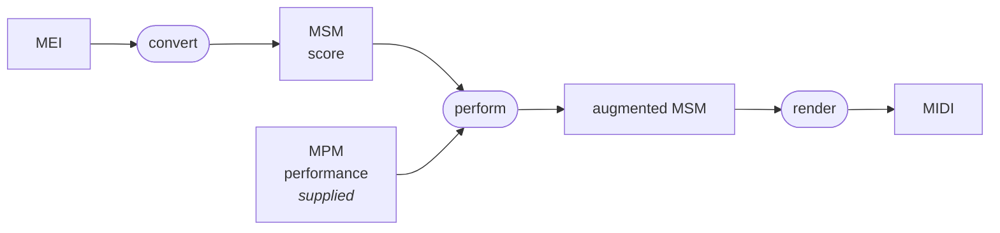

# espressivo

espressivo is a TypeScript library for creating, fitting, transforming, rendering and comparing
[Music Performance Markup](https://axelberndt.github.io/MPM/). The rendering pipeline is in large
part a TypeScript-idiomatic port of the Java library [meico](https://github.com/cemfi/meico) by
Axel Berndt and others. Apart from a few [deliberate differences](PARITY.md), the pipeline is
[verified](docs/equivalence.md) against meico byte for byte.

An MEI is converted to an MSM — what is played — and the MPM saying _how_ it is played is yours
to supply.

## Install

```sh
npm install espressivo
```

espressivo runs in Node and in the browser. Requires Node ≥ 22 on the server; in the browser,
Chrome 122, Firefox 131 or Safari 18.4 and up.

## Quick start

### Rendering



Score plus performance to expressive MIDI:

```ts
import { readFileSync, writeFileSync } from 'node:fs';
import { convertMeiToMsm, renderExpressiveMidi } from 'espressivo';

const [movement] = convertMeiToMsm(readFileSync('sonata.mei', 'utf-8'), {
  sourceName: 'sonata.mei',
});
const mpm = readFileSync('sonata.mpm', 'utf-8');

writeFileSync('sonata.mid', renderExpressiveMidi({ msm: movement.msm, mpm }));
```

### Expression transforms (musical exaggeration)

meico applies an MPM to a score; it never transforms the MPM. `exaggerateMpm` and `spotlightMpm`
do: **MPM text in, MPM text out**, nothing rendered and nothing extracted.

```ts
// Every tempo and dynamics deviation, further from neutral.
const { mpm, report } = exaggerateMpm(mpmText, { factors: { tempo: 1.6, dynamics: 1.4 } });

// Damp everything the selected instructions do not govern, to a quarter.
const brought = spotlightMpm(mpmText, { ids: ['t2', 'dyn4'], attenuation: 0.25 });
```

Each attribute is mapped into a space where its _neutral_ is 0, scaled, and mapped back, so `s = 1`
is the identity, `s > 1` pushes away from neutral and `s = 0` writes the neutral itself. Fifteen
dimensions scale independently; `weightedFactors` collapses them onto one slider. The result keeps
the input's exact skeleton — no element or attribute added or removed, no `@date` ever written —
and performs to the same symbolic notes; the report names every site that was clamped, skipped or
found inert, and `report.totalWrites === 0` is the exact test for a no-op. Deterministic, no RNG.

Use it to sample a family of performances from one encoding, to damp everything but the phrase you
are studying, or to drive a single "how expressive?" control.

→ [`docs/expression.md`](docs/expression.md), [PARITY.md §7](PARITY.md)

### Comparing performances

`compareMpm` measures two MPM performances against each other across eleven expressive channels at
once, including the two that carry performer identity most strongly and that an audio-derived
tempo-and-loudness curve cannot see: articulation and melody lead.

```ts
const { report } = compareMpm({ a: grave, performanceA: 'Baroque', performanceB: 'Romantic', msm });

report.aggregate.mean; // 41.16 JND — the human headline
report.dimensions.tempo.distance; // how much of it is tempo
report.segments[0]; // where the difference concentrates
```

Every dimension is compared as a **function of score time** rather than as a list of instructions,
so two documents that spell the same performed curve differently compare at exactly 0. The total is
an integral of the pointwise difference in just-noticeable differences, and it **decomposes exactly**
— by dimension, by score passage, with zero residual — which as far as a verified literature survey
could establish has no prior art for symbolic performance-directive encodings. Alongside it,
`diffMpm` answers _what would you have to change_ with a cost-ranked edit script in the same units,
`compareMpmCorpus` turns a folder into matrices, clusters and an MDS embedding, and `scape` gives
Sapp's timescape over every position and timescale.

→ [`docs/comparison.md`](docs/comparison.md)

### Fitting measurements back to instructions

The renderer runs one way: instruction, value at a date, millisecond. Analysis and editing run the
other way, and nothing here has a meico counterpart. `dateAtMilliseconds` says which tick a
millisecond falls on — the exact inverse of `millisecondsAt`, so it inverts the curve the renderer
draws rather than a closed form of the curve someone believed was there. `fitTransitionCurve` says
which `@curvature` and `@protraction` explain a series of observed values, by simulated annealing
over a surface that is not convex; the randomness is the caller's, so a seeded generator fits the
same points the same way every time. `fitMeanTempoAt` asks the same of a `<tempo>`, and
`meanTempoAtForElapsedTime` finds the shape that makes a span last a given time — or answers
`null`, because what to do when no shape reaches it is a decision about the document.

## API reference

You can find the full API documentation [here](https://pfefferniels.github.io/espressivo/).

## Provenance

- **Upstream**: [cemfi/meico](https://github.com/cemfi/meico) by Axel Berndt (Paderborn
  University) and contributors, the Java original this is a port of.
- **MPM**: the [Music Performance Markup](https://axelberndt.github.io/MPM/) format by Axel
  Berndt; its v3 ornamentation model by Lars Engeln and Axel Berndt, and others who contributed
  to the specification's development.
- **Reference used for verification**: the fork
  [pfefferniels/meico](https://github.com/pfefferniels/meico). It provides the full suite of
  fixtures used to prove byte-equivalence of the generated outputs.
- **Disclosure**: all of the code base was written by agentic AI (Claude Code).

## Development

```sh
npm run verify        # clean build + typecheck the tests + full suite — the gate
npm run gate          # the byte surface only: 4 suites, 121 tests, ~2s — what to iterate on
npm run bench         # rendering benchmark; --check compares against the committed baseline
npm test              # suite only
npm run test:coverage # scoped coverage (see vitest.config.ts)
npm run lint          # eslint, type-aware
npm run format        # prettier
npm run build         # tsc; always preceded by a dist wipe, so no stale output can ship
npm run docs          # typedoc; the API reference site, into api-docs/
```

## License

Copyright (C) 2026 Niels Pfeffer.

espressivo is a derivative work of [meico](https://github.com/cemfi/meico) by Axel Berndt and
others, which is published under the **GNU GPL v3**, so the same terms apply here. espressivo is
published under **GPL-3.0-only**: meico's grant names version 3.0 and does not carry the "or any
later version" clause, so this port does not extend it either. The full text is in
[LICENSE](LICENSE).
